# Advanced Statistics Workshop
Dr Randy Johnson
2026-07-18

## Workshop Overview

<!--
This This document relies on quarto-pyodide extension for quarto. Install with:
&#10;`quarto add coatless-quarto/pyodide`
-->

- Bayes’ Rule & Monty Hall: Updating beliefs based on new evidence.
  <!-- 15 minutes -->
- The Intractability Problem: *Why* do we need computational stats?
  <!-- 10 minutes -->
- MCMC & Python Code: Metropolis-Hastings for numerical integration.
  <!-- 15 minutes -->
- Q&A / Wrap-up <!--  5 minutes -->

## Probability Review

A Venn diagram can be a useful tool when thinking about probabilities.
Let’s say that we have two events, `A` and `B`, with a circle
representing each event.

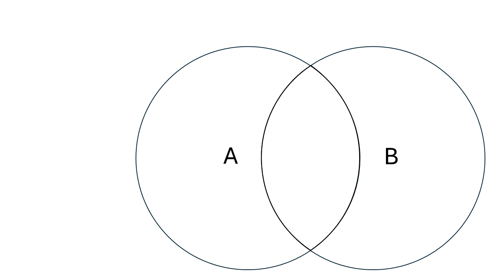

We can visualize the probabilitis of `A` and `B` as the area of each
circle in this Venn diagram, so the probability of observing event, `A`
is

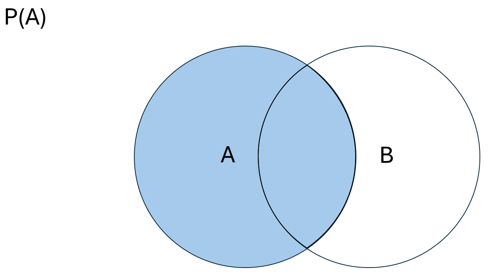

and the probability of observing event `B` is

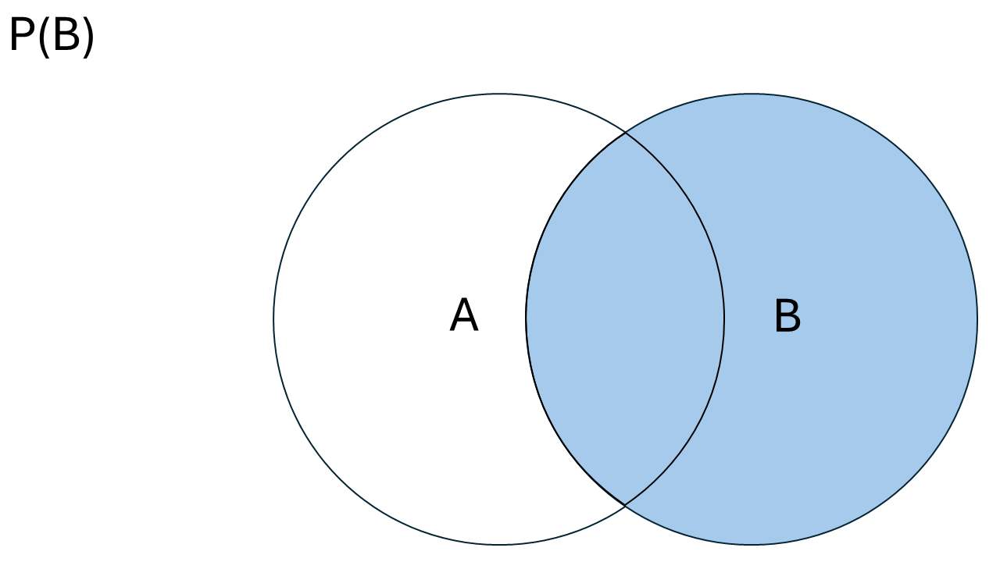

The probability of observing `A` or `B` is called the union

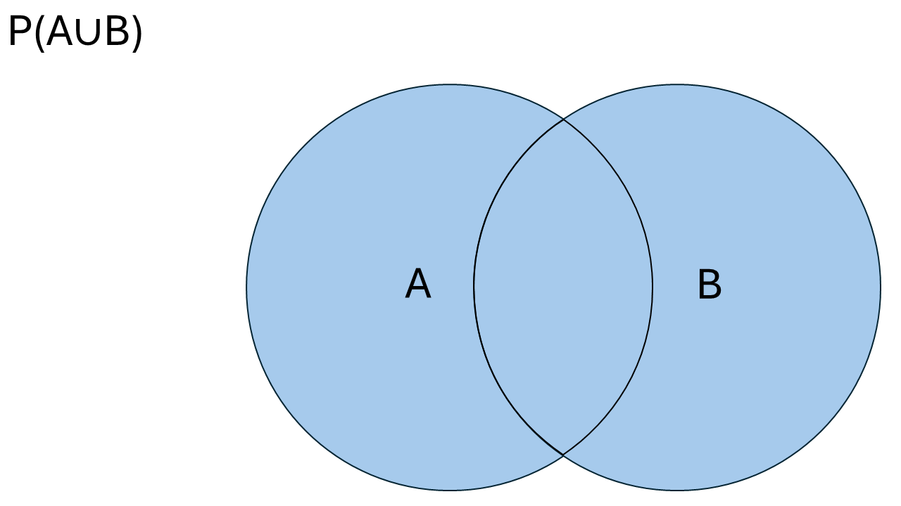

and the probability of observing both `A` and `B` is called the
intersection.

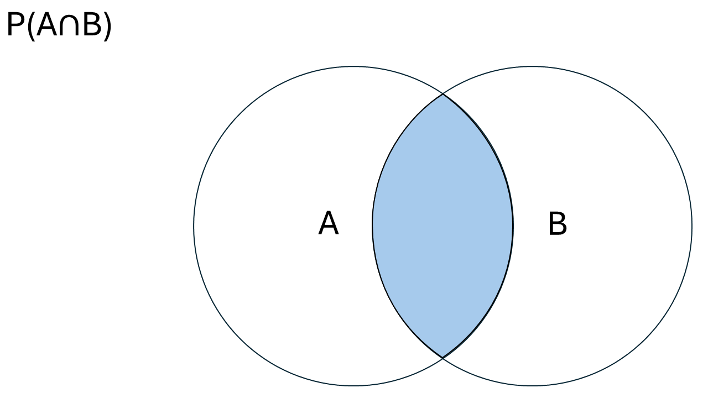

We can also visualize conditional probability. The probability of
observing event `A` given the fact that we know event `B` has already
happened is

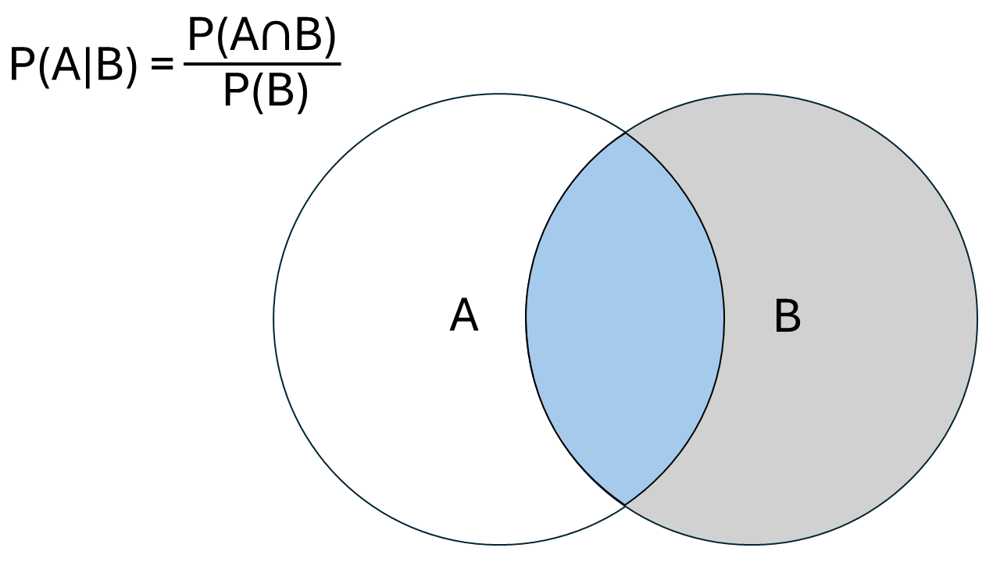

### Bayes Rule

Rev. Thomas Bayes observed that

and thus

$$
P(A|B) = \frac{P(A) * P(B|A)}{P(B)} 
$$

### The Monty Hall Problem

Monty Hall ran a gameshow in the 60’s and 70’s called *Let’s Make a
Deal*. At the end of the show, the final contestant was given an
opportunity to win a car.

- The contestant first picks between three doors. Behind one is the car,
  the other two are goats.
- Monty Hall reveals a goat behind one of the doors that wasn’t picked.
- The contestant the has to decide to stick with their original choice
  or switch their chioce to the third door.

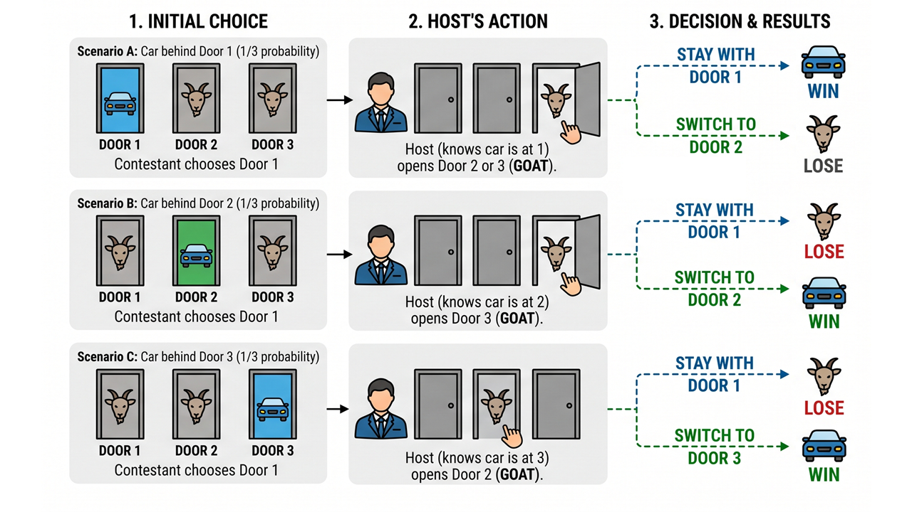

What is the “right” choice?

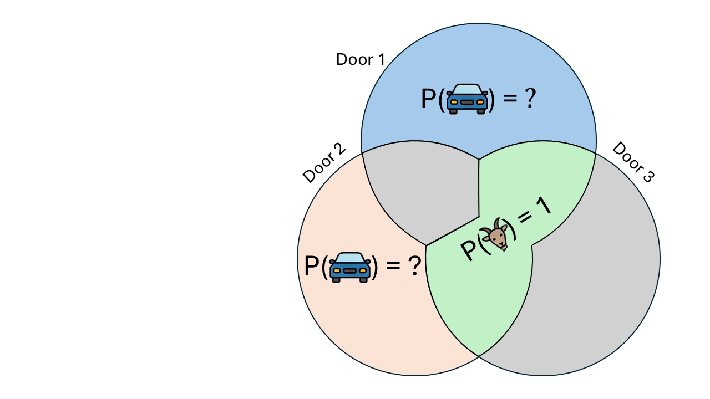

Let’s change the sequence of events. Which is the right choice now?

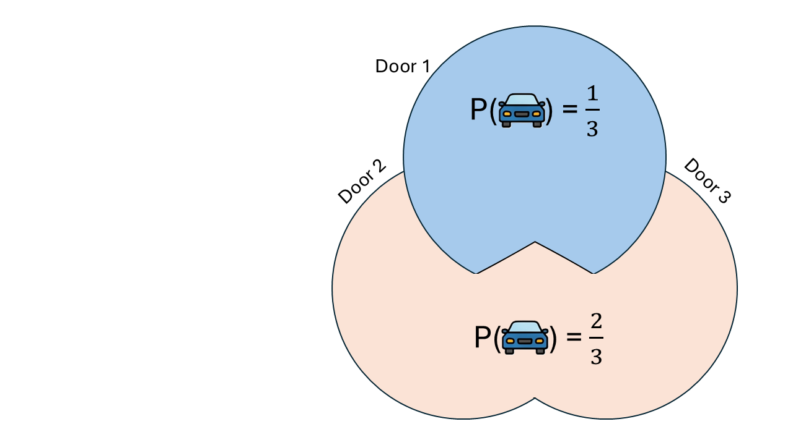

There is nothing special about Monty Hall’s reveal that changes the
probabilities.


### Back to Bayes

We can reframe this in terms of an initial hypothesis with evidence. The
probability of getting a goat is the same regardless of the door we
pick, so let’s go with door 1.

<!--
$$
P(\mbox{Car}) = \frac{1}{3} \forall \mbox(Doors)
$$
-->

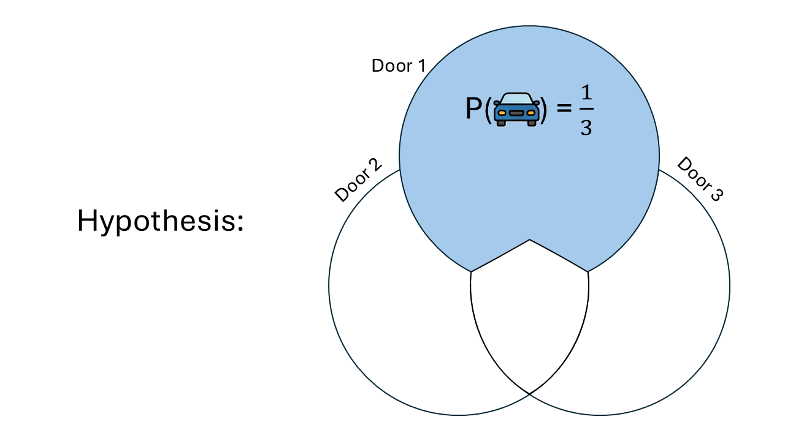

Then Monty Hall reveals that there is a goat behind door 3.

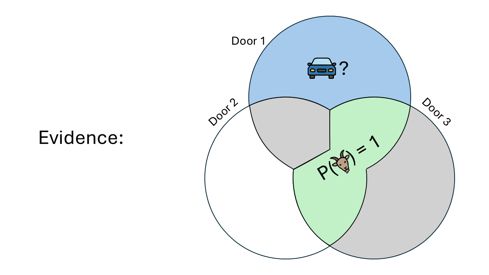

#### Posterior Probability

The posterior probability that the car is behind door 2, given that we
originally picked door 1 and Monty revealed a goat behind door 3 is:

$$
P(D_2 | E) = \frac{P(E | D_2) * P(D_2)}{P(E)}
$$

If $D_2$ hides the car and we picked $D_1$, then Monty has to open
$D_3$:

$$
P(E|D_2) = 1
$$

The unconditional probability that the car is behind door 2:

$$
P(D_2) = \frac{1}{3}
$$

The unconditional probability that Monty will open door 3:

$$
P(E) = \frac{1}{2}
$$

Thus, our posterior probability that the car is behind door 2 is:

## Application: Integration

- In real-world machine learning (like training neural networks or
  modeling health data), hypotheses aren’t always discrete outcomes;
  they are often continuous parameters.

- The evidence denominator, $P(E)$, isn’t a simple sum anymore. It
  becomes an integral over all possible parameters:

$$
P(E) = \int P(E | H)P(H) dH
$$

- In high-dimensional spaces (e.g. hundreds of variables), this integral
  is analytically impossible to compute. We know the *shape* of our
  posterior, but we can’t calculate its exact scale (the denominator).

### Markov Chain Monte Carlo (MCMC)

- MCMC is like trying to map the topography of a mountain range while
  blindfolded in the fog.
  - You can’t observe the terain (compute the integral), but you can
    walk around and feel if you are going uphill or downhill.

<!-- -->

- Markov Chain Monte Carlo (MCMC) is an algorithm that takes a “random
  walk” through the parameter space.
  - It prefers to spend time in areas of high probability (the peaks)
    and rarely visits low probability areas (the valleys).
  - By *counting* where the algorithm spends its time, we can
    approximate the integral without ever having to solve it
    mathematically.

### Metropolis-Hastings

We’ll be using the Metropolis-Hastings algorithm to perform this random
walk and estimate the integral of a bimodal probability distribution:

$$
\int e^{\frac{-(x-2)^2}{2}} + e^{\frac{-(x+3)^2}{2}} dx
$$

- We know the shape of the equation
- We need the integral clalculated from 0 to $\infty$ to be able to
  normalize the distribution (i.e. so all probabilities add to 1)
- Integration is annoying, and becomes impossible when equations become
  complex

#### Set up python environment

``` {pyodide-python}
import numpy as np
import matplotlib.pyplot as plt
```

#### Define our function

``` {pyodide-python}
#' Probability distribution we want to integrate
#' @param x Numeric defining a point on the x-axis
#' @return The corresponding value on the y-axis

def target_pdf(x):
    return np.exp(-0.5 * (x - 2)**2) + 0.5 * np.exp(-0.5 * (x + 3)**2)
```

#### Define the MH function

``` {pyodide-python}
#' Metropolis Hastings function
#' @param iterations Integer value specifying the number of times to run the algorithm
#' @return A vector of locations where the MH algorithm spent time

def metropolis_hastings(iterations=10000):
    samples = np.zeros(iterations)
    current_x = 0.0  # Start somewhere arbitrary
    
    for i in range(iterations):
        # Step 1: Propose a nearby random state (the "Markov Chain" step)
        proposed_x = np.random.normal(loc=current_x, scale=1.0)
        
        # Step 2: Compare the new state to the current state
        # The denominator cancels out here!
        ratio = target_pdf(proposed_x) / target_pdf(current_x)
        acceptance_prob = min(1.0, ratio)
        
        # Step 3: Accept or reject the move (the "Monte Carlo" step)
        if np.random.rand() < acceptance_prob:
            current_x = proposed_x
            
        # Log our position
        samples[i] = current_x
        
    return samples
```

#### Run the algorithm

``` {pyodide-python}
samples = metropolis_hastings()
```

#### Plot the results

``` {pyodide-python}
plt.hist(samples, bins=50, density=True, alpha=0.6, color='b')
plt.title("MCMC Approximation of the Target Distribution")
plt.show()
```

(output only availabe on live html/revealjs pages)
